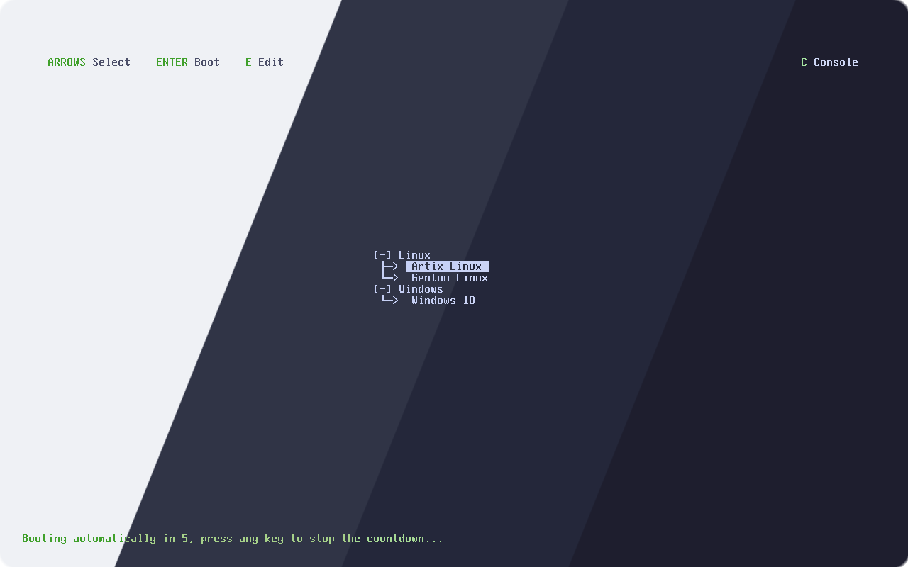
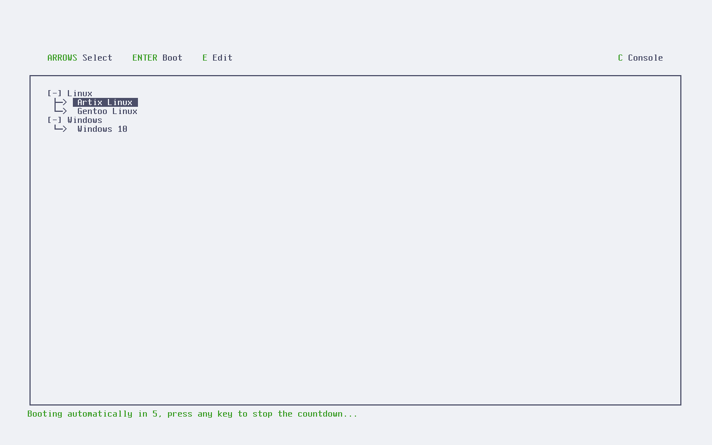
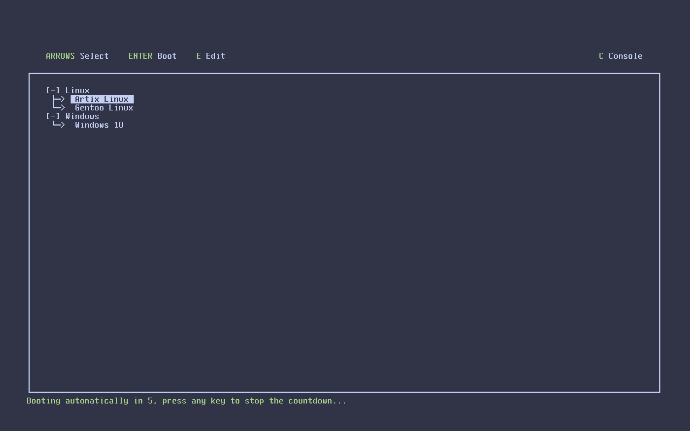
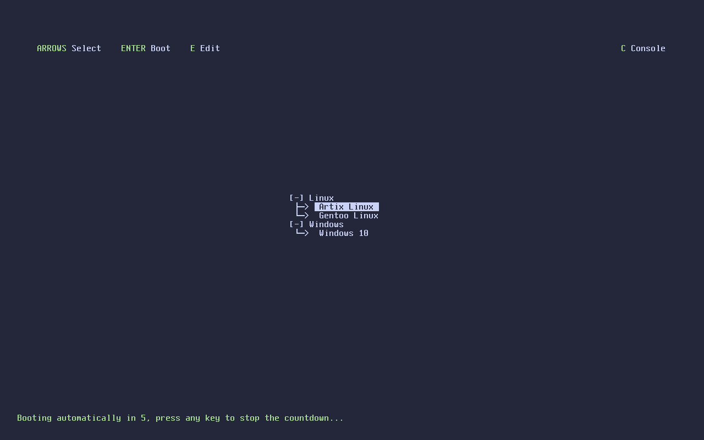
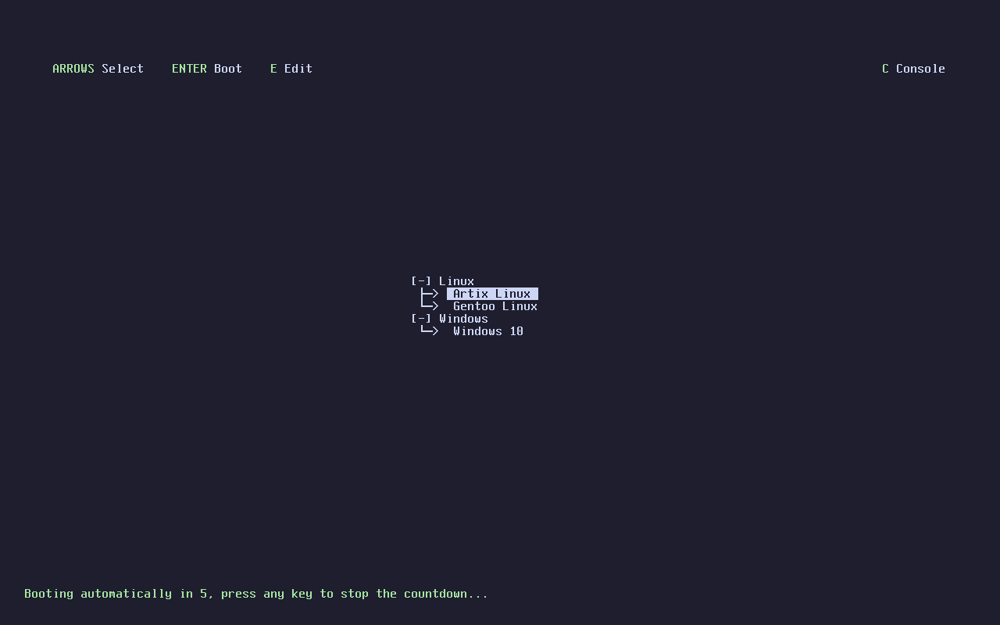

<h3 align="center">
	 
	
	Catppuccin for <a href="https://limine-bootloader.org/">Limine</a>
	
</h3>

	
	
	

	

## Previews

🌻 Latte

🪴 Frappé

🌺 Macchiato

🌿 Mocha

## Usage

1. Clone this repository locally
2. Run `./generate.sh <theme>` (eg `./generate.sh mocha`)
    - Alternatively, if you would like to use different Catppuccin colors for your boot menu, open the respective file in `themes/` and edit accordingly
3. Paste the output to the start of your Limine config file
    - This file is typically located at `/boot/limine.cfg` or `/boot/efi/limine.cfg`

## 🙋 FAQ

-	Q: **_"How can I hide the Limine title text like in the screenshot?"_**\
	A: Add `INTERFACE_BRANDING=` to Limine config file, this will set it to an empty string

-	Q: **_"What other configuration options exist?"_**\
	A: See [limine/CONFIG.md](https://github.com/limine-bootloader/limine/blob/v7.x/CONFIG.md)

## 💝 Thanks to

- [mekb](https://github.com/mekb-turtle)

&nbsp;

	

	Copyright &copy; 2021-present <a href="https://github.com/catppuccin" target="_blank">Catppuccin Org</a>

	

