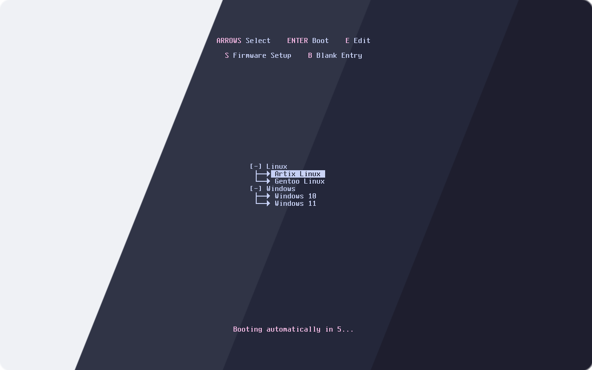
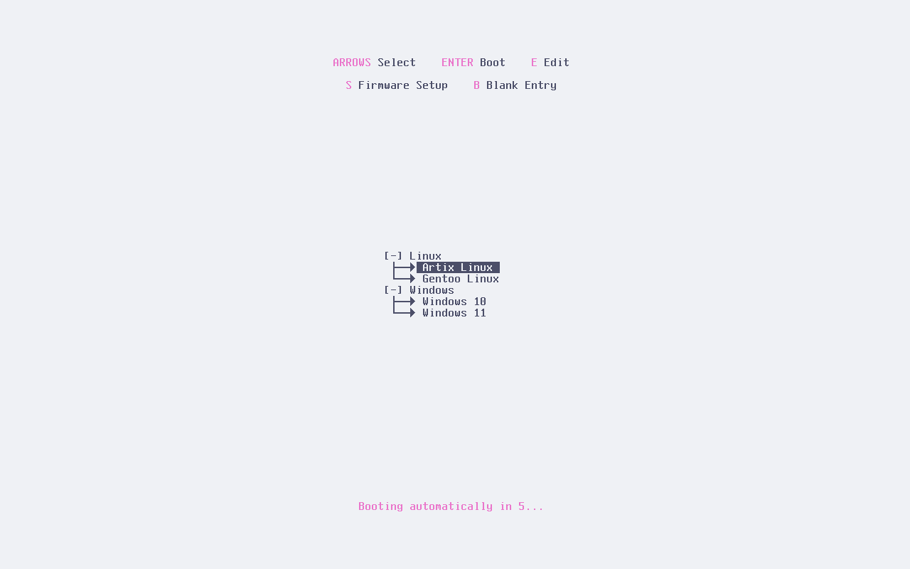
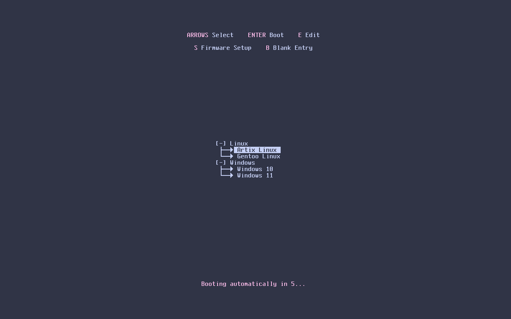
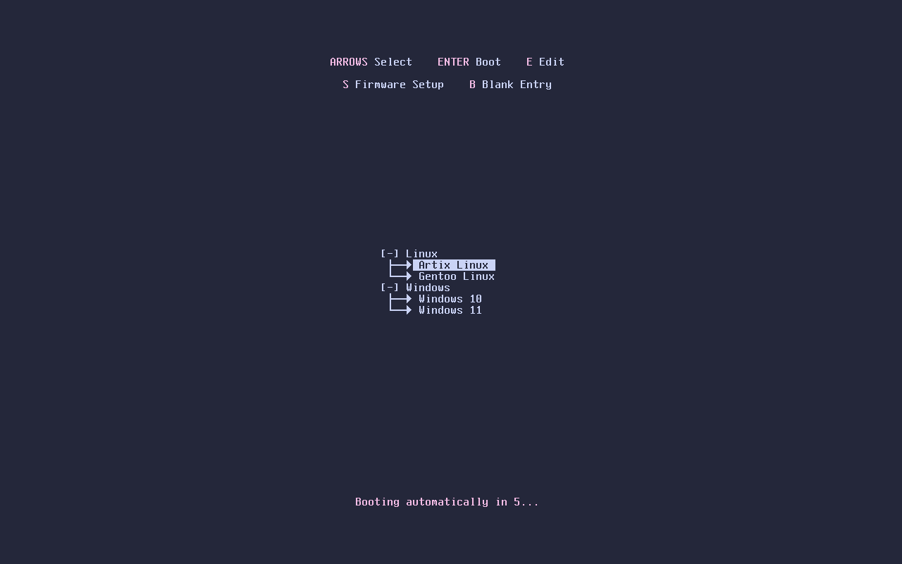
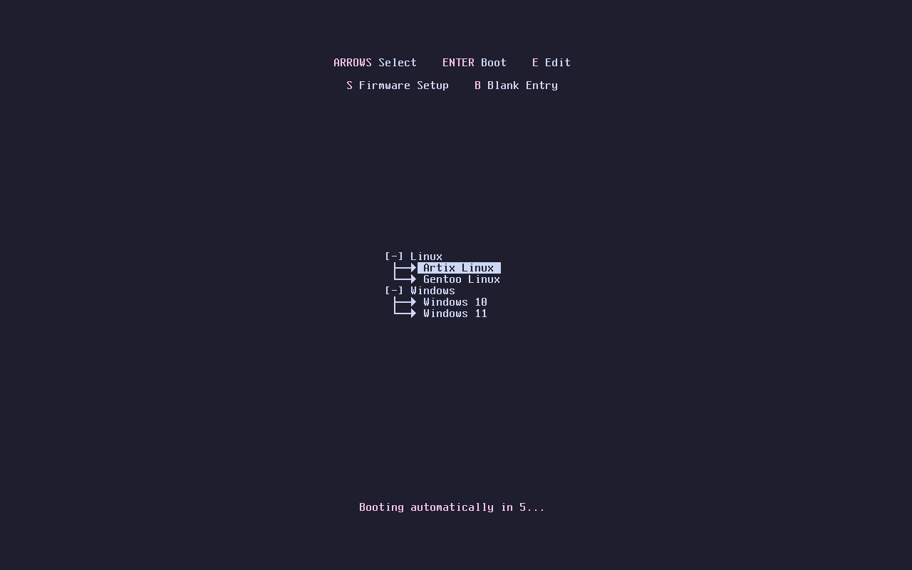

<h3 align="center">
	 
	
	Catppuccin for <a href="https://limine-bootloader.org/">Limine</a>
	
</h3>

	
	
	

	

## Previews

🌻 Latte

🪴 Frappé

🌺 Macchiato

🌿 Mocha

## Usage

1. Open the flavor and accent combination of your choice from [`themes/`](./themes/)
2. Paste the contents of that file to the start of your Limine configuration file, which is typically located at `/boot/limine.conf` or `/boot/efi/limine.conf`.

## 🙋 FAQ

- Q: **_"How can I hide the Limine title text like in the screenshot?"_**\
  A: Add `interface_branding:` to your configuration file to set it to an empty string and hide it.

- Q: **_"What other configuration options exist?"_**\
  A: See [Limine CONFIG.md](https://github.com/limine-bootloader/limine/blob/v12.x/CONFIG.md).

- Q: **_"How can I have separate colors for each text element?"_**\
  A: You can use [overrides](https://whiskers.catppuccin.com/concepts/overrides/#frontmatter-overrides) when generating the theme files: `whiskers limine.tera --overrides '{`JSON object`}'`.\
  You will need to [install Whiskers](https://whiskers.catppuccin.com/getting-started/installation/) to generate these.\
  Afterward, new themes will be generated in the `themes/` directory.\
  Valid keys are `interface_branding_color`, `interface_help_color`, `interface_help_color_bright`.\
  Valid values are the Catppuccin colors.\
  See [Limine interface control options](https://github.com/Limine-Bootloader/Limine/blob/v12.x/CONFIG.md#options) for info on these options.\
  For example, you can run `whiskers limine.tera --overrides '{"interface_help_color":"pink"}'` to override the color of the help text to pink.

## 💝 Thanks to

- [sophur](https://github.com/sophuric)

&nbsp;

	

	Copyright &copy; 2021-present <a href="https://github.com/catppuccin" target="_blank">Catppuccin Org</a>

	

